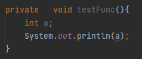
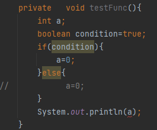
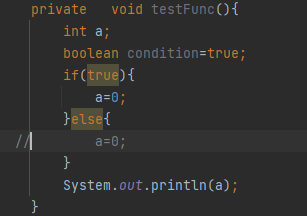
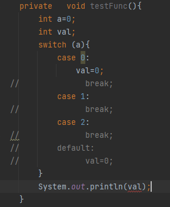
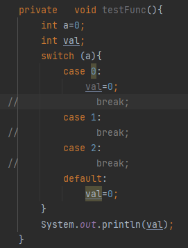

### Working with Java Data Types
Java da primitive data tipleri Object değillerdir. Object den inherit olmazlar. Java pure object oriented language olarak düşünülmemelidir.

#### Working with Variables
- Değişken isimleri harf, rakam, '_', '$' karakterlerini içerebilir.
- Değişken isimlerinin ilk karakteri harf,'_', veya '$' olabilir.
- İlk karakter rakam olamaz.
- Değişken isimleri büyük/küçük harf duyarlıdır(case sensitive).
- Reserved keywordler değişken ismi olamazlar.
- '_' tek başına değişken ismi olarak kullanılamaz. Java 9 dan bu yana reserved keyword olmuştur.
- Değişken tanımlarken aynı satırda birden fazla tip tanımı yapılamaz.
  int num1, double num2 = 0; veya int num1,int num2 = 0; bunlar yanlıştır.
  
- Statik(Class) numerik değişkenlerin ve Object değişkenleri (byte, char, short, int, long, float, double) default değerleri 0' dır.
- Statik(Class) boolean değişkenlerin default değeri false dur.

- Local değişkenleri initialize etmek zorunludur. Local değişkenleri initialize etmeden kullandığımızda compiler hata vermektedir.
Tanımlarken atama yapmak zorunda değiliz. Ancak kullanmadan önce değer atama yapılmalıdır.

  

  if statement gibi dallanmalı durumlarda atama yapılıyorsa kullanmadan önce atama yapıldığından emin olunmalıdır.
Örneğin koşullu bir durumda atama yapılmama ihtimali varsa(if de atama yapılıp else de yapılmıyosa) compile error verecektir.

Aşağıdaki gibi bir durumda if koşulu değişken olmadığı için hata vermemektedir.

Aynı durum switch case yapısında da geçerlidir. Ya tüm state ler de atama yapılmalı yada 
atama yapılmayan statelerde break edilmemeli ve default metod da atama yapılmalıdır.

Yani olası tüm dallarda atama yapılmış olmalıdır.

